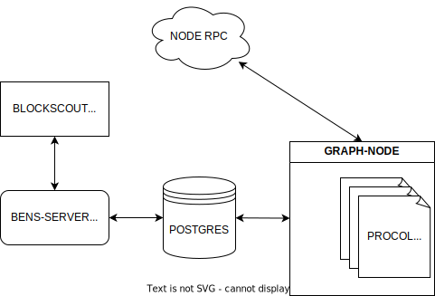

# Blockscout ENS service

This project provides indexed data of domain name service for blockscout instances.

Here is brief overview of the project stucture:

Service is **multi-chain**, meaning that only one instance of `graph-node`, `postgres` and `bens-server` is required.

## Contribute

If you want to add your name service procol to blockscout you should:

1. Clone this `blockscout-rs` repo to add new protocol.
1. Write subraph code: read [subgraph writer guide](./graph-node/subgraph-writer/README.md#howto-create-subgraph-for-your-domain-name-protocol)
1. Start graph-node: read [graph-node guide](./graph-node/README.md#start-locally-using-docker-compose)
1. Deploy subgraph to graph-node: read [how to deploy subgraphs guide](./graph-node/subgraphs/README.md#deploy-subgraph-to-graph-node)
1. Update default config of BENS server for [production](../../bens-server/config/prod.json) and [staging](../../bens-server/config/staging.json)
1. Start `bens-server` connected to common database: read [how to start bens guide](./bens-server/README.md#to-start-locally)
1. Check that `bens-server` responses with valid domains
1. Add your protocol to list of [supported domains](./graph-node/subgraphs/README.md#current-supported-domains)
1. Finally, create PR with:
    * New directory inside `blockscout-ens/graph-node/subgraphs` with your subgraph code
    * Updated BENS config
    * Updated supported domains list
    * Result of indexed data: proof that your indexed subgraph contains correct amount of domains, resolved_addresses and so on
