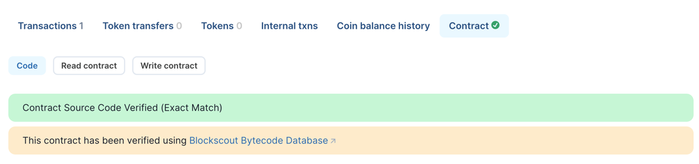

# <h1 align="center">Ethereum Bytecode Database</h1>

The Ethereum Bytecode Database is a cross-chain smart contract database 
designed for automatic contract verification. It serves as a proxy between users 
and the [smart-contract-verifier](../smart-contract-verifier) service. 
This verifier stores verified contract data in the database 
and enables searches for contracts with similar bytecodes.

You will recognize the service in action when you see the notification: 
"The contract has been verified using Blockscout Bytecode Database."

[Learn more](https://docs.blockscout.com/about/features/ethereum-bytecode-database-microservice#solution-ethereum-bytecode-database-blockscout-ebd)

### Verifier Alliance (VERA)
The service also interfaces with the 
[Verifier Alliance](https://verifieralliance.org/who.html) database, 
a shared repository of contract source codes from different EVM chains and verification providers.

Blockscout is a data provider for this database, 
and the eth-bytecode-db service writes data into it. 
This database is also used for contract searches.

Note: Currently, you cannot connect to VERA if you run your own eth-bytecode-db instance. 
Only predefined providers with the required credentials have write access. 
If you are a data provider seeking write access, please email join@verifieralliance.org. 
For read access, we plan to open-source the data, 
but direct access to the database from the service will still require credentials.

## Requirements
- Postgresql database
- smart-contract-verifier

## How to enable
Set the following ENVs on blockscout instance:
- `MICROSERVICE_SC_VERIFIER_ENABLED=true`
- `MICROSERVICE_SC_VERIFIER_URL={service_url}`
- `MICROSERVICE_SC_VERIFIER_TYPE=eth_bytecode_db`
- `MICROSERVICE_ETH_BYTECODE_DB_INTERVAL_BETWEEN_LOOKUPS={m}` (optional) -
  minimal time after unsuccessful check of smart contract's sources in Eth Bytecode DB
- `MICROSERVICE_ETH_BYTECODE_DB_MAX_LOOKUPS_CONCURRENCY={}` (optional) -
  maximum amount of concurrent requests for fetching smart contract's sources in Eth Bytecode DB
- `MICROSERVICE_SC_VERIFIER_API_KEY={}` (optional) -
  API key for verification that metadata sent to verifier microservice from a trusted source.
  Should correspond to any of `ETH_BYTECODE_DB__AUTHORIZED_KEYS__{name}__KEY` value.
  Used if the service has access to verifier-alliance database.

## Envs
Here, we describe variables specific to this service. Variables common to all services can be found [here](../docs/common-envs.md).

[anchor]: <> (anchors.envs.start)

| Variable                                               | Required | Description                                                                                | Default value                  |
|--------------------------------------------------------|----------|--------------------------------------------------------------------------------------------|--------------------------------|
| `ETH_BYTECODE_DB__DATABASE__URL`                       | true     | Postgres connect URL to internal database with read/write access                           | (empty)                        |
| `ETH_BYTECODE_DB__DATABASE__CREATE_DATABASE`           |          | Create internal database if doesn't exist                                                  | `false`                        |
| `ETH_BYTECODE_DB__DATABASE__RUN_MIGRATIONS`            |          | Run internal database migrations                                                           | `false`                        |
| `ETH_BYTECODE_DB__VERIFIER__HTTP_URL`                  | true     | HTTP URL to underlying smart-contract-verifier service                                     | (empty)                        |
| `ETH_BYTECODE_DB__VERIFIER__MAX_RETRIES`               |          | Number of attempts the server makes to smart-contract-verifier service. Must be at least 1 | `3`                            |
| `ETH_BYTECODE_DB__VERIFIER__PROBE_URL`                 |          | If true, will check that `VERIFIER_HTTP_URL` can be connected to on startup                | `false`                        |
| `ETH_BYTECODE_DB__SOURCIFY__BASE_URL`                  |          | Sourcify API url                                                                           | `https://sourcify.dev/server/` |
| `ETH_BYTECODE_DB__SOURCIFY__MAX_RETRIES`               |          | Number of attempts the server makes to Sourcify API. Must be at least 1                    | `3`                            |
| `ETH_BYTECODE_DB__VERIFIER_ALLIANCE_DATABASE__ENABLED` |          | If true, enables connection to verifier alliance database                                  | `false`                        |
| `ETH_BYTECODE_DB__VERIFIER_ALLIANCE_DATABASE__URL`     |          | Postgres connect URL to verifier alliance database with read/write access                  | (empty)                        |

[anchor]: <> (anchors.envs.end)

## Links
- Demo - https://eth-bytecode-db.services.blockscout.com/
- [Swagger](https://blockscout.github.io/swaggers/services/eth-bytecode-db/index.html)
- [Packages](https://github.com/blockscout/blockscout-rs/pkgs/container/eth-bytecode-db)
- [Releases](https://github.com/blockscout/blockscout-rs/releases?q=eth-bytecode-db&expanded=true)