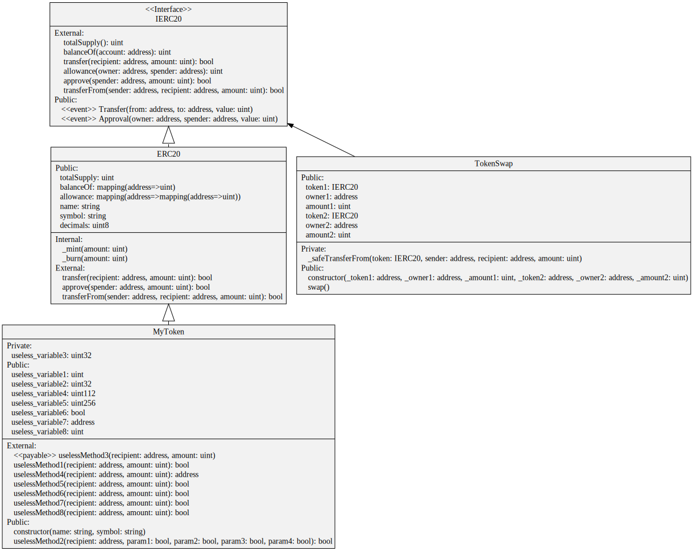
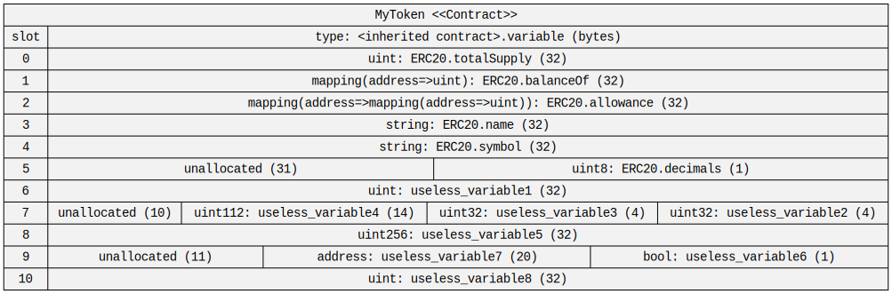

# Visualizer
A service for generating Unified Modeling Language (UML) class diagrams and storage diagrams for Solidity contracts based on Node.js package
[sol2uml](https://github.com/naddison36/sol2uml).

## Requirements
- NodeJs environment with linked `sol2uml` binary (see [installation guide](https://github.com/naddison36/sol2uml?tab=readme-ov-file#install)) 

## How to enable
Set the following ENVs on blockscout instance:
- `MICROSERVICE_VISUALIZE_SOL2UML_ENABLED=true`
- `MICROSERVICE_VISUALIZE_SOL2UML_URL={service_url}`

## Envs
Here, we describe variables specific to this service. Variables common to all services can be found [here](../docs/common-envs.md).

[anchor]: <> (anchors.envs.start)

| Variable                                          | Required | Description                                                          | Default value                                      |
|---------------------------------------------------|----------|----------------------------------------------------------------------|----------------------------------------------------|

_* There are no service specific variables for the service_

[anchor]: <> (anchors.envs.end)

## Result Examples

### UML diagram



### Storage



## Usage

The service runs in a Docker container, which creates two images when it is built. One of them is intermediate and can be removed.
Use `docker-compose` to build the service. The service only accepts **POST** requests.

### Generate UML diagram

Request path is `/solidity/uml`, request should contain **JSON** with single key `sources`, value for this key is map with
**relative file path - file content** pairs.

Example:

```json
{
  "sources": {
    "src/test1.sol": "...first contract code..."
    "src/test2.sol": "...second contract code..."
  }
}
```

Service response contains JSON with single key `uml_diagram`, which value is the bytecode of UML diagram in svg format.

### Generate storage diagram

Request path is `/solidity/storage`, request should contain **JSON** with such keys:

- `sources`, value for this key is map with **relative file path - file content** pairs, same as for `/uml`.
- `main_contract`, contains the name of the contract for which the store will be generated.
- `main_contract_filename`, contains the name of file with `main_contract`. Needed for situations when
there is more than one contract with `main_contract` name. **Be careful, at the moment the service may not work correctly
when there are two contracts with the same name in files with the same filename**.

Example:

```json
{
  "sources": {
    "src/test1.sol": "...first contract code with 'Main' contract..."
    "src/test2.sol": "...second contract code..."
  },
  "main_contract": "Main",
  "main_contract_filename": "test1.sol"
}
```

Service response contains JSON with single key `storage`, which value is the bytecode of storage diagram in svg format.

## Testing

For now it is only possible to test service using `cargo test`. For this you need to install [sol2uml](https://github.com/naddison36/sol2uml)
globally on your device as mentioned in the repo instructions. Notice that the current version of `sol2uml` supported by the service is 2.1, so tests
may fail with other versions and service may not work correctly.

For testing on **Windows** you need to rewrite some code due to the way the service is implemented. Change
[99 line in `src/handlers.rs`](./src/handlers.rs#L99) with:

```let output = Command::new("cmd").arg("/C").arg("sol2uml").args(args).output().await?;```

`/C` should be replaced with the drive where sol2uml is installed.

## Links
- Demo - https://visualizer.services.blockscout.com
- [Swagger](https://blockscout.github.io/swaggers/services/visualizer/index.html)
- [Packages](https://github.com/blockscout/blockscout-rs/pkgs/container/visualizer)
- [Releases](https://github.com/blockscout/blockscout-rs/releases?q=visualizer&expanded=true)
